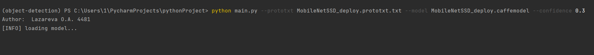
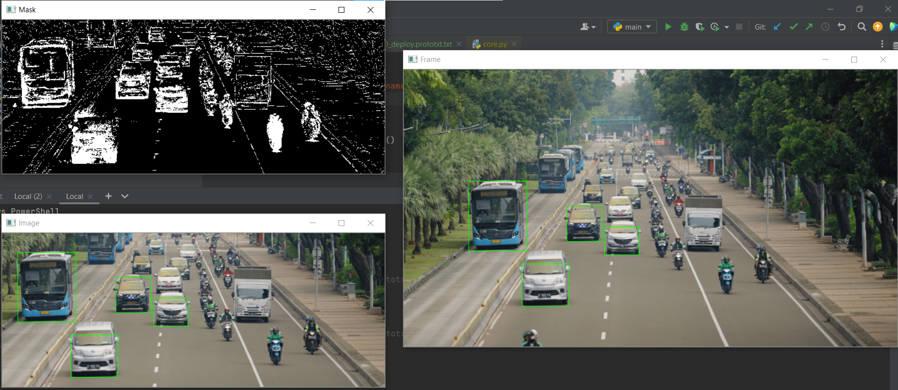

# Vehicles-Counting-in-Real-Time

Vehicles Counting in Real-Time using live video stream/IP camera in OpenCV.
- The primary aim is to use the project as a business perspective, ready to scale.
- Use case: counting the number of vehicles on the intersection malls etc., in real-time.
- Automating features and optimising the real-time stream for better performance (with threading).

--- 

## Table of Contents
* [Simple Theory](#simple-theory)
* [Running Inference](#running-inference)

## Simple Theory
**SSD detector:**
- We are using a SSD (Single Shot Detector) with a MobileNet architecture. In general, it only takes a single shot to detect whatever is in an image. That is, one for generating region proposals, one for detecting the object of each proposal. 
- Compared to other 2 shot detectors like R-CNN, SSD is quite fast.
- MobileNet, as the name implies, is a DNN designed to run on resource constrained devices. For example, mobiles, ip cameras, scanners etc.
- Thus, SSD seasoned with a MobileNet should theoretically result in a faster, more efficient object detector.

## Running Inference
- First up, install all the required Python dependencies:
```
pip install -r requirements.txt
```
- Then clone MobileNet-SSD Caffe model:
```
git clone https://github.com/chuanqi305/MobileNet-SSD.git
```
- To run inference on a test video file, head into the directory/use the command: 
```
python main.py  –-prototxt mobilenet_ssd/MobileNetSSD_deploy.prototxt.txt 
--model mobilenet_ssd/MobileNetSSD_deploy.caffemodel  –confidence 0.3
```
<div align="center">
    
</div>

The result of running program:
<div align="center">
    
</div>